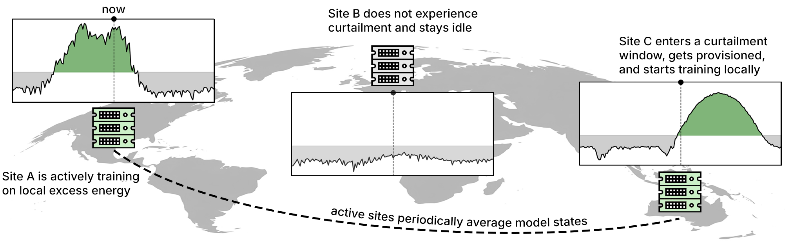

# curtail-llm

Technical report: [Distributed LLM Pretraining During Renewable Curtailment Windows: A Feasibility Study](https://arxiv.org/pdf/2602.22760) 

This prototype trains a 561M-parameter [nanochat](https://github.com/karpathy/nanochat) d20 transformer across geographically distributed GPU clusters. 
Training is scheduled only during periods of local renewable energy curtailment, when electricity is both clean and (depending on procurement contracts) cheap.
- Federated training is coordinated via [Flower](https://flower.ai/).
- Nodes are elastically added/removed using [Exalsius](https://www.exalsius.ai/) and a custom [Flower Kubernetes operator](https://github.com/exalsius/flower-operator).
- Energy system dynamics are simulated by [Vessim](https://vessim.readthedocs.io/en/latest/), with curtailment periods derived from real-world marginal carbon intensity traces provided by [WattTime](https://watttime.org/).



Figure 1 | Sites train only during curtailment windows (green), when renewable generation exceeds
demand. If multiple sites are curtailed simultaneously, they train locally in parallel and periodically
average model states.
In our experiment, curtailment-aware scheduling preserves training quality while **reducing operational emissions to 5-12% of single-site baselines**.

## Setup

This setup explains how to run the system on a single machine (in our case 8xA100 GPUs) using the `SubprocessProvisioner`, simulating multiple clients via separate processes.
For replicating the distributed deployment with the `ExalsiusProvisioner`, please refer to the [Exalsius documentation](https://docs.exalsius.ai/) and the [exalsius/flower-operator](https://github.com/exalsius/flower-operator) repository or reach out to us!

### Installation (all nodes)

Clone the repository and install dependencies:

```bash
uv venv
uv sync
source .venv/bin/activate
```

### Data & Tokenizer Setup (all nodes)

The nanochat tokenizer uses a Rust BPE implementation.
To install Rust / Cargo and build the tokenizer extension, run:

```bash
curl --proto '=https' --tlsv1.2 -sSf https://sh.rustup.rs | sh -s -- -y
source "$HOME/.cargo/env"
uv run maturin develop --release --manifest-path rustbpe/Cargo.toml
```

Next, prepare the tokenizer:

```bash
export NANOCHAT_BASE_DIR=/workspace/cache/nanochat/
python -m nanochat.dataset -n 240  # Download dataset for tokenizer training (~22GB of FineWeb-EDU data)
python -m scripts.tok_train --max_chars=4000000000 --vocab_size=65536  # Train BPE tokenizer on ~4B characters, takes about 3min
python -c "from nanochat.tokenizer import get_tokenizer; print(f'Vocab size: {get_tokenizer().get_vocab_size()}')"
```

### Redis Setup (head node only)

The system uses Redis for coordination between server and clients.
Redis must be accessible by all nodes, run via:

```bash
sudo apt-get update
sudo apt-get install redis-server
redis-server --daemonize yes
redis-cli ping
```

## Deployment

Deploy across multiple physical nodes:

0. Make sure Redis is running.
```bash
redis-server --daemonize yes
redis-cli ping
```

1. Start the energy simulation (Vessim):
```bash
tmux new -A -s vessim

cd /workspace/pilot
source .venv/bin/activate

python energy_simulation.py
```

2. Start Flower SuperLink (coordinator):
```bash
tmux new -A -s superlink

cd /workspace/pilot
source .venv/bin/activate
export WANDB_API_KEY=<your-key>

flower-superlink --insecure
```

3. Start SuperNodes (workers) on each GPU:
```bash
# Client 0
tmux new -A -s client_0

cd /workspace/pilot
source .venv/bin/activate
export NANOCHAT_BASE_DIR=/workspace/cache/nanochat/

CUDA_VISIBLE_DEVICES=0,1 flower-supernode --insecure \
  --superlink 127.0.0.1:9092 \
  --clientappio-api-address 127.0.0.1:9094 \
  --node-config 'name="client_0" partition-id=0'
```

```bash
# Client 1
tmux new -A -s client_1

cd /workspace/pilot
source .venv/bin/activate
export NANOCHAT_BASE_DIR=/workspace/cache/nanochat/

CUDA_VISIBLE_DEVICES=4,5,6,7 flower-supernode --insecure \
  --superlink 127.0.0.1:9092 \
  --clientappio-api-address 127.0.0.1:9095 \
  --node-config 'name="client_1" partition-id=1'
```

4. Run the Flower app:
```bash
cd /workspace/pilot
source .venv/bin/activate
flwr run . local-deployment --stream
```

You can override config values from the command line:

```bash
flwr run . local-deployment --run-config "lr=0.0005" --stream
```

### Vanilla nanochat Baseline

```bash
tmux new -A -s baseline

cd /workspace/pilot
source .venv/bin/activate
export NANOCHAT_BASE_DIR=/workspace/cache/nanochat/

CUDA_VISIBLE_DEVICES=4,5,6,7 torchrun --standalone --nproc_per_node=4 \
  -m scripts.base_train -- --depth 20 --target_param_data_ratio 20 \
  --device_batch_size 8 --run baseline
```


## Cite as

Wiesner, Philipp, Soeren Becker, Brett Cornick, Dominik Scheinert, Alexander Acker, and Odej Kao. 2026. _Distributed LLM Pretraining During Renewable Curtailment Windows: A Feasibility Study_. Technical Report arXiv:2602.22760. Exalsius.

```bibtex
@techreport{wiesner2026curtailllm,
  title = {Distributed LLM Pretraining During Renewable Curtailment Windows: A Feasibility Study},
  author = {Wiesner, Philipp and Becker, Soeren and Cornick, Brett and Scheinert, Dominik and Acker, Alexander and Kao, Odej},
  institution = {Exalsius},
  number = {arXiv:2602.22760},
  year = {2026}
}
```
